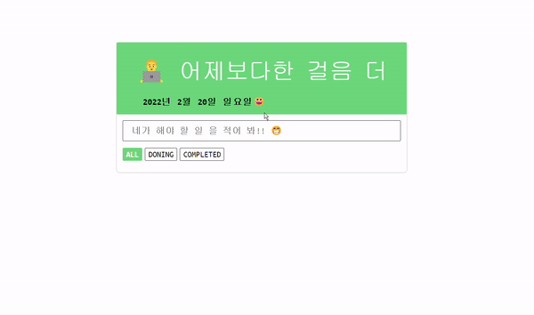

# 1. TodoList 살펴보기 🔎

<p align=center style="color:#b9b9b9">프로젝트 기간 2021.07.22 ~ 2021.07.26</p>

### 🔥 서비스 소개

 <h4>오늘 해야되는 일을 간단히 적어 놓을 수 있는 웹앱입니다.</h4>

### ⭐️ 주요 기능

- 메모는 최대 10개까지 입력가능합니다.
- 완료가 된 일은 삭제가 가능합니다.
- 적은 메모는 유저가 삭제하기 전까지는 없어지지 않습니다.

### 💻 기술 스택

- `TypeScript`
- `React`
- `Styled-components`
- `crypto-js`

> #### 📁 프로젝트 구조

```ts
├─component  // UI를 구성하는 컴포넌트들이 있는 폴더입니다.
├─helpers    // 유틸함수가 모여있는 폴더입니다.
└─types      // 타입을 정의해놓은 폴더입니다.
```

> #### ⚙ 프로젝트 실행 해보기

```js
mkdir todoList
cd todoList
git clone https://github.com/dnr14/React-Todo-List.git
npm -g i serve
npm install
npm run build
serve build
브라우저 localhost:3000 접속
```

> #### 👨‍💻 구현화면

- [체험하기](https://dnr14.github.io/todoList)

<div align=center>
  
</div>

<br>

### 🔥 핵심 기능 설명

1.  서버와 DB를 이용하지 않아서 리스트 저장은 로컬스토리지를 이용했습니다. 유저가 리스트를 작성할때 마다 저장하는건 불 필요하다는 생각이 들어서 브라우저를 이탈했을 때 로컬스토리지에 저장합니다.

```ts
useEffect(() => {
  // 로컬스토리지가 없으면 생성을한다.
  if (!hasKeys(LOCALSTORAGE_NAME)) {
    makeLocalStorage();
  }

  const handleBeforeUnload = () => {
    const encodedArray = encrypt(todoArray, SECRET_KEY);
    setItem(LOCALSTORAGE_NAME, encodedArray);
  };

  // 유저가 브라우저를 이탈하면 로컬스토리지에 작성한 리스트를 저장한다.
  window.addEventListener("beforeunload", handleBeforeUnload);
}, [todoArray, makeLocalStorage]);
```

2.  로컬스토리지에 저장된 내용은 다른 사람들이 볼 수 없도록 cyroto 모듈을 통해 암호화를 했습니다. AES 대칭키 암호화에 필요한 키 값은 환경변수에서 관리를 합니다.

```ts
const handleBeforeUnload = () => {
  const encodedArray = encrypt(todoArray, SECRET_KEY);
  setItem(LOCALSTORAGE_NAME, encodedArray);
};

// .env
// REACT_APP_SECRET_KEY=secret-key-1;
```
